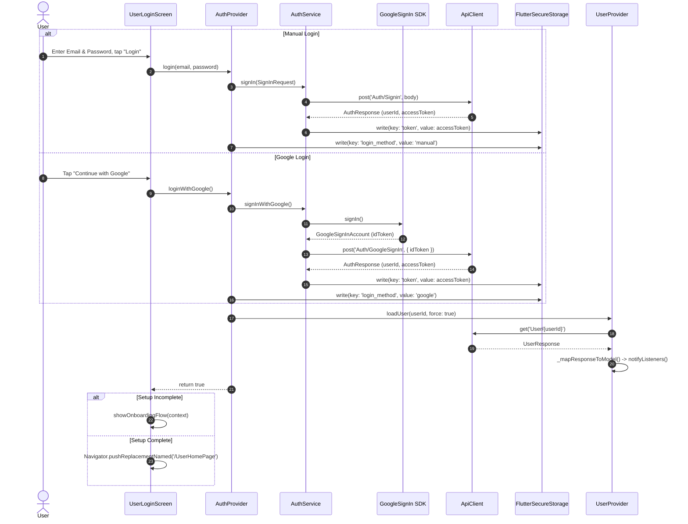
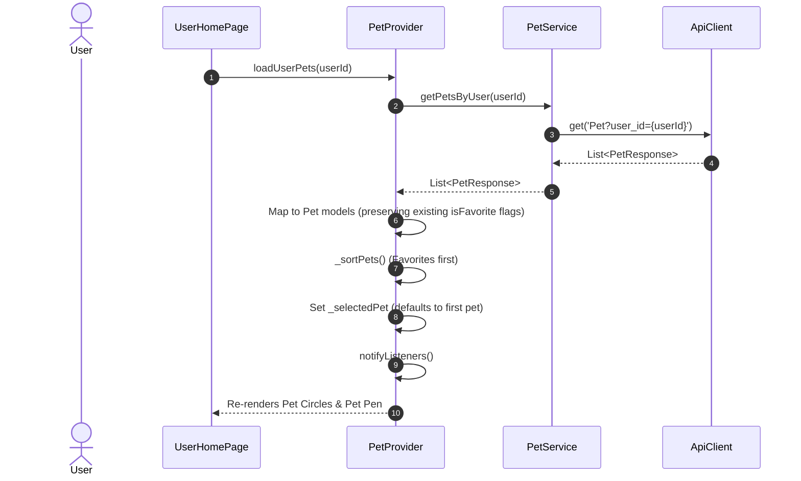
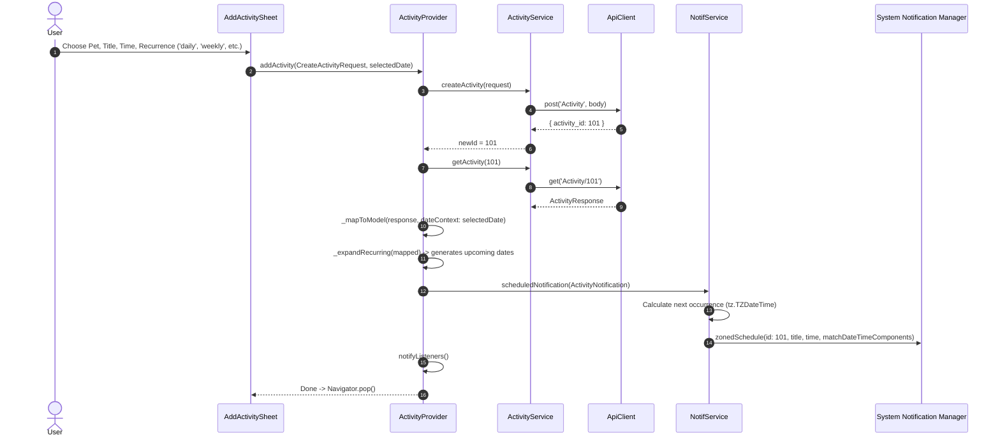
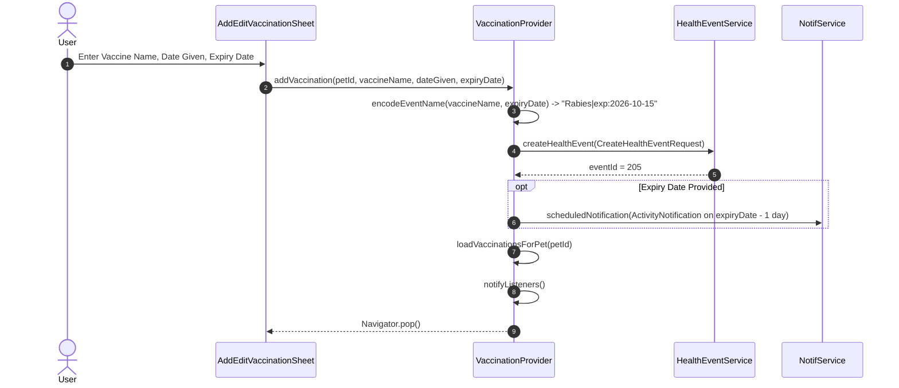
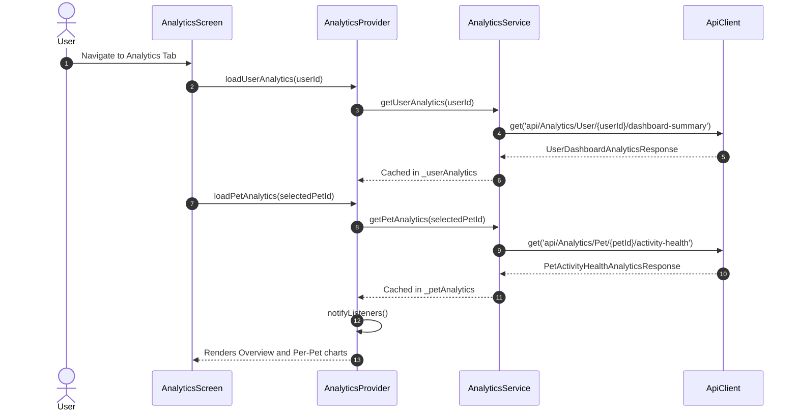
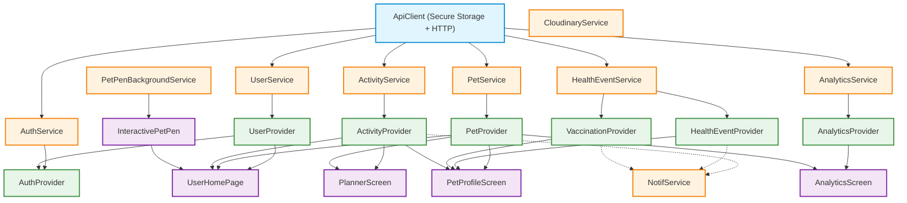

# Petwise: System Architecture & Data Flow Documentation

This document provides a comprehensive technical guide to the **Petwise** application architecture, state management model, data flow lifecycle, and inter-component dependencies. It is structured to help developers understand how data moves through the app and serve as a reliable reference when implementing new features.

---

## 1. High-Level Architecture

Petwise follows a **Layered Architecture** inspired by Clean Architecture principles, separated into Presentation, State Management (Business Logic), Domain/Data Models, Service & Network, and Contract DTOs.

```
┌────────────────────────────────────────────────────────────────────────┐
│                        Presentation Layer                              │
│   Screens (e.g. UserHomePage, PlannerScreen, PetProfileScreen)          │
│   Widgets (e.g. DynamicActivityCard, InteractivePetPen, Sheets)        │
└───────────────────▲────────────────────────────────┬───────────────────┘
                    │ Observes State (watch/select)   │ Calls Actions (read)
┌───────────────────┴────────────────────────────────▼───────────────────┐
│                    State Management (Providers)                        │
│   AuthProvider, UserProvider, PetProvider, ActivityProvider,           │
│   HealthEventProvider, VaccinationProvider, AnalyticsProvider          │
└───────────────────▲────────────────────────────────┬───────────────────┘
                    │ DTOs / Domain Models            │ Requests / Params
┌───────────────────┴────────────────────────────────▼───────────────────┐
│                        Service Layer                                   │
│   AuthService, UserService, PetService, ActivityService,               │
│   HealthEventService, AnalyticsService, CloudinaryService, NotifService│
└───────────────────▲────────────────────────────────┬───────────────────┘
                    │ Raw Decoded JSON Maps           │ HTTP / Local I/O
┌───────────────────┴────────────────────────────────▼───────────────────┐
│                   Infrastructure & External Systems                     │
│   ApiClient (http + FlutterSecureStorage)                              │
│   Remote REST API Backend (Base URL from AppConfig)                     │
│   Cloudinary CDN (Direct Media Uploads)                                │
│   Local SQLite/System Alarms (flutter_local_notifications)             │
│   Device Preferences (shared_preferences)                              │
└────────────────────────────────────────────────────────────────────────┘
```

### Architectural Principles in Petwise
1. **Unidirectional Data Flow**: The UI triggers actions on Providers -> Providers delegate I/O to Services -> Services call `ApiClient` -> Responses return as Contracts -> Mapped to Domain Models -> State updates -> `notifyListeners()` informs the UI.
2. **Separation of Concerns**: UI screens contain minimal business logic; all API operations, state storage, and notification scheduling reside in Providers and Services.
3. **Dependency Injection**: Root `MultiProvider` in [main.dart](file:///d:/Data/Desktop/flutter%20app/Petwise/lib/main.dart) orchestrates services and providers using `ProxyProvider` and `ChangeNotifierProxyProvider`.
4. **Resilient Client Enrichment**: Features like recurring schedules, date tags (`|d:`), and vaccination expiry dates (`|exp:`) are gracefully encoded and calculated on the client side to work cleanly with backend schemas.

---

## 2. Directory Structure & Module Breakdown

```
lib/
├── contracts/             # Data Transfer Objects (DTOs) for API payload contracts
│   ├── activity/          # CreateActivityRequest, UpdateActivityRequest, ActivityResponse
│   ├── analytics/         # UserDashboardAnalyticsResponse, PetActivityHealthAnalyticsResponse, ActivityTimelineSlot
│   ├── auth/              # SignInRequest, SignUpRequest, ChangePasswordRequest, AuthResponse
│   ├── health_event/      # CreateHealthEventRequest, HealthEventResponse
│   ├── pet/               # CreatePetRequest, UpdatePetRequest, PetResponse
│   └── user/              # CreateUserRequest, UpdateUserRequest, UserResponse
├── data/
│   └── models/            # Client-side domain models with business logic & formatting
│       ├── activity_model.dart      # Activity domain model + recurrence logic
│       ├── health_event_model.dart  # Health event domain model
│       ├── notification_model.dart  # Local notification entity
│       ├── pet_model.dart           # Pet entity with computed getters (e.g. age)
│       ├── user_model.dart          # User profile model
│       └── vaccination_model.dart   # Vaccination model + expiry & status calculation
├── presentation/
│   ├── screens/           # Full-page views and route destinations
│   │   ├── user_homepage_screen.dart       # Dashboard, Pet Pen, favorites, today's schedule
│   │   ├── pet_profile_screen.dart         # Pet details, medical pills, vax status
│   │   ├── pet_activity_planner_screen.dart# TableCalendar schedule board
│   │   ├── vaccination_screen.dart         # Vaccination records management
│   │   ├── analytics_screen.dart           # User & per-pet charts & metrics
│   │   ├── pet_card_screen.dart            # Pet list overview
│   │   ├── add_pet_profile_screen.dart     # Pet registration
│   │   ├── edit_pet_profile_screen.dart    # Pet profile modification
│   │   ├── user_profile_screen.dart        # User account & logout
│   │   ├── edit_user_profile_screen.dart   # User details & avatar upload
│   │   ├── user_login_screen.dart          # Credentials + Google Auth
│   │   ├── user_signup_screen.dart         # Account creation
│   │   ├── user_profile_signup_screen.dart # Secondary setup step
│   │   └── login_or_signup_screen.dart     # Initial entry landing screen
│   ├── widgets/           # Modular, reusable presentation components
│   │   ├── petwise_pet_pen.dart            # Interactive physics canvas with animated sprites
│   │   ├── petwise_pet_pen_bg_picker.dart  # Custom background selector for Pet Pen
│   │   ├── petwise_dynamic_activity_card.dart # Activity swipe-to-edit / swipe-to-delete
│   │   ├── petwise_fading_activity_card.dart  # Animated completion checkbox card
│   │   ├── petwise_add_activity_sheet.dart    # Activity creation bottom sheet
│   │   ├── petwise_edit_activity_sheet.dart   # Activity editing bottom sheet
│   │   ├── petwise_add_health_event_sheet.dart# Medical event bottom sheet
│   │   ├── petwise_add_edit_vaccination_sheet.dart # Vaccination bottom sheet
│   │   ├── petwise_Navbar.dart             # Global bottom navigation bar (4 tabs)
│   │   ├── petwise_app_bar.dart            # Standard top bar + notifications modal
│   │   ├── petwise_image_picker_sheet.dart # Camera/Gallery selector
│   │   └── petwise_confirmation_dialog.dart# Custom modal alerts
│   └── test/              # In-app integration test screens (e.g. auth_test_screen.dart)
├── providers/             # ChangeNotifier state controllers
│   ├── auth_provider.dart
│   ├── user_provider.dart
│   ├── pet_provider.dart
│   ├── activity_provider.dart
│   ├── health_event_provider.dart
│   ├── vaccination_provider.dart
│   └── analytics_provider.dart
├── routes/
│   └── app_route.dart     # Named route table and route constants
├── services/              # External service communication & hardware APIs
│   ├── api_client.dart                 # HTTP client with automatic Bearer token injection
│   ├── auth_service.dart               # Auth API + GoogleSignIn SDK
│   ├── user_service.dart               # User profile REST endpoints
│   ├── pet_service.dart                # Pet CRUD REST endpoints
│   ├── activity_service.dart           # Activity REST endpoints
│   ├── health_event_service.dart       # Health event REST endpoints
│   ├── analytics_service.dart          # Aggregated dashboard metrics endpoints
│   ├── cloudinary_service.dart         # Direct multipart image uploading
│   ├── notif_service.dart              # Flutter Local Notifications + Timezones
│   └── pet_pen_background_service.dart # SharedPreferences background persistence
├── utils/
│   ├── app_config.dart    # Environment variables via --dart-define
│   └── pet_theme.dart     # Species-specific color palettes and typography
└── main.dart              # App bootstrap, MultiProvider tree, ThemeData
```

---

## 3. End-to-End Data Flow Models

Every feature in Petwise follows a predictable, traceable flow. Below are the core data flows documented in detail.

### 3.1. Authentication & Session Flow

The app supports both email/password credentials and Google OAuth. The JWT is persisted securely via `FlutterSecureStorage`.



---

### 3.2. Pet Management Flow

Pets belong to a user. When retrieved, favorites are sorted to the front of the list, and a `selectedPet` is cached for contextual actions.



---

### 3.3. Activity Scheduling & Notification Synchronization Flow

Petwise has a unique dual-layer synchronization:
1. **Cloud Persistence**: Stores the activity via REST API.
2. **Hardware Persistence**: Schedules exact platform alarms via `flutter_local_notifications`.
3. **Date Tag Protocol**: The backend only stores `timeScheduled` (`HH:mm:ss`). Petwise encodes the scheduled date into the activity description using a `|d:YYYY-MM-DD` tag, allowing the client to reconstruct full `DateTime` instances upon fetching.
4. **Recurrence Expansion**: When `recurrence` is `daily`, `weekly`, or `monthly`, `ActivityProvider` creates synthetic instances (`${baseId}_${timestamp}`) up to 3 months in advance.



#### Activity Completion & Deletion Behavior:
- **Toggle Done**: Calls `ActS.patchActivity(baseId, isActive: false)`. If completed, immediately calls `NotifService().cancelNotification(baseId)`. If un-completed, reschedules the notification.
- **Delete**: Calls `ActS.deleteActivity(baseId)` and `NotifService().cancelNotification(baseId)`. Removes all synthetic instances (`id.startsWith('${baseId}_')`) from local memory.

---

### 3.4. Health Event & Vaccination Lifecycle

Vaccinations are stored under the generic `HealthEvent` backend table (`type = 'vaccination'`). 

- **Vaccination Encoding Protocol**: The expiry date is encoded in `eventName` as:
  `{vaccineName}|exp:{YYYY-MM-DD}`
- **Status Computation**: The client computes whether a vaccine is `valid`, `expiringSoon` ($\le 30$ days), or `expired` dynamically against `DateTime.now()`.
- **Pre-expiry Notifications**: If an expiry date is set, `VaccinationProvider` schedules an automatic notification 1 day before expiration (`expiryDate.subtract(Duration(days: 1))`).



---

### 3.5. Analytics & Dashboard Data Flow

Analytics data is consumed at two levels:
1. **User Global Dashboard**: Aggregates totals (pets, routines, health compliance rate, recurrence distribution, activity timeline) for the authenticated user.
2. **Individual Pet Metrics**: Deep dive into pet health and routine completion metrics.



---

## 4. Component Interaction & Dependency Tree

The entire application state tree is defined in [main.dart](file:///d:/Data/Desktop/flutter%20app/Petwise/lib/main.dart). Services are singletons or pure stateless classes powered by `ApiClient`.



### Key Provider Coordination Details
- **AuthProvider & UserProvider**: `AuthProvider` is wired via `ChangeNotifierProxyProvider2<AuthService, UserProvider, AuthProvider>`. On successful login, `AuthProvider` directly invokes `_userProvider.loadUser(authResponse.userId, force: true)`.
- **Global Logout**: When the user signs out in [user_profile_screen.dart](file:///d:/Data/Desktop/flutter%20app/Petwise/lib/presentation/screens/user_profile_screen.dart), `AuthProvider.logout` explicitly receives `petProvider` and `activityProvider` to call `.clear()` on all of them, preventing residual state leaks between sessions.
- **UserHomePage Orchestration**: In `initState`, `UserHomePage` loads user pets. Once pets return, it extracts all `petIds` and calls `ActivityProvider.loadAllActivities(petIds)`.

---

## 5. Core Subsystem Implementations

### 5.1. Interactive Pet Pen & Sprite Physics ([petwise_pet_pen.dart](file:///d:/Data/Desktop/flutter%20app/Petwise/lib/presentation/widgets/petwise_pet_pen.dart))
The interactive pen is a custom-built 2D physics simulation widget:
- **Game Loop**: A 50ms periodic `Timer` handles position updates, horizontal walking speeds, and vertical gravity/landing velocity.
- **Behavior Loop**: A 4000ms periodic `Timer` randomly assigns pet states (`walking`, `idle`, `sleeping`).
- **Interactive Gestures**:
  - `onPanUpdate`: Allows the user to drag any pet sprite across the canvas.
  - `onPanEnd`: Triggers a falling state with acceleration until `groundLevel` is reached.
  - `onTap`: Plays pet audio clips (`oi.mp3`, `huh.mp3`, `yaha.mp3`) via `audioplayers` and renders a floating heart reaction.
  - `onLongPress`: Reveals a floating pet profile shortcut pill.
- **Dynamic Face Pinning**: Uses species detection (`dog`, `cat`, `bunny`, `generic`) and calculates frame-specific Cartesian offsets (`_getFaceOffsets`) to overlay the pet's actual profile photo onto the animated 2D sprite body.

### 5.2. Cloudinary Media Upload Pipeline ([cloudinary_service.dart](file:///d:/Data/Desktop/flutter%20app/Petwise/lib/services/cloudinary_service.dart))
Pet and user pictures bypass the primary REST backend:
1. `image_picker` picks an image from `ImageSource.gallery` or `ImageSource.camera`.
2. `CloudinaryService.uploadImage(File)` sends a `multipart/form-data` POST request directly to:
   `https://api.cloudinary.com/v1_1/${AppConfig.cloudinaryCloudName}/image/upload`
3. The returned `secure_url` string is passed in `CreatePetRequest`, `UpdatePetRequest`, or `UpdateUserRequest`.

### 5.3. Notification Engine ([notif_service.dart](file:///d:/Data/Desktop/flutter%20app/Petwise/lib/services/notif_service.dart))
- Utilizes `flutter_timezone` and `timezone/data/latest.dart` to resolve device local timezones.
- Uses `AndroidNotificationDetails` with `Importance.max`, `Priority.max`, and exact alarm mode `exactAllowWhileIdle`.
- Maps recurrence (`daily`, `weekly`, `monthly`) to `DateTimeComponents` (`time`, `dayOfWeekAndTime`, `dayOfMonthAndTime`).

---

## 6. How to Build a New Feature: Developer Guide

Follow this standardized 7-step checklist whenever you introduce a new feature (e.g. *Pet Meal Tracking*, *Weight Journal*, or *Medication Tracker*).

### Step 1: Define API Contracts (DTOs)
Create requests and responses in `lib/contracts/<feature_name>/`.
```dart
// lib/contracts/meal/create_meal_request.dart
class CreateMealRequest {
  final int petId;
  final String foodType;
  final double portionGrams;
  final DateTime mealTime;

  CreateMealRequest({
    required this.petId,
    required this.foodType,
    required this.portionGrams,
    required this.mealTime,
  });

  Map<String, dynamic> toJson() => {
    'pet_id': petId,
    'food_type': foodType,
    'portion_grams': portionGrams,
    'meal_time': mealTime.toIso8601String(),
  };
}
```

### Step 2: Define Domain Model
Create domain entities in `lib/data/models/<feature_name>_model.dart`.
```dart
// lib/data/models/meal_model.dart
class MealModel {
  final int id;
  final int petId;
  final String foodType;
  final double portionGrams;
  final DateTime mealTime;

  MealModel({
    required this.id,
    required this.petId,
    required this.foodType,
    required this.portionGrams,
    required this.mealTime,
  });

  factory MealModel.fromJson(Map<String, dynamic> json) => MealModel(
    id: json['meal_id'] as int,
    petId: json['pet_id'] as int,
    foodType: json['food_type'] as String,
    portionGrams: (json['portion_grams'] as num).toDouble(),
    mealTime: DateTime.parse(json['meal_time']).toLocal(),
  );
}
```

### Step 3: Implement the Service
Add HTTP methods in `lib/services/<feature_name>_service.dart` wrapping `ApiClient`.
```dart
// lib/services/meal_service.dart
import 'api_client.dart';
import '../contracts/meal/create_meal_request.dart';
import '../data/models/meal_model.dart';

class MealService {
  final ApiClient _apiClient;
  MealService(this._apiClient);

  Future<int> logMeal(CreateMealRequest request) async {
    final res = await _apiClient.post('Meal', request.toJson());
    return res['meal_id'] as int;
  }

  Future<List<MealModel>> getMealsByPet(int petId) async {
    final res = await _apiClient.get('Meal?pet_id=$petId');
    return (res as List).map((j) => MealModel.fromJson(j)).toList();
  }
}
```

### Step 4: Implement the Provider
Manage loading states, error handling, caching, and reactivity in `lib/providers/<feature_name>_provider.dart`.
```dart
// lib/providers/meal_provider.dart
import 'package:flutter/material.dart';
import '../services/meal_service.dart';
import '../data/models/meal_model.dart';
import '../contracts/meal/create_meal_request.dart';

class MealProvider with ChangeNotifier {
  MealService? _service;
  List<MealModel> _meals = [];
  bool _isLoading = false;
  String? _error;

  List<MealModel> get meals => _meals;
  bool get isLoading => _isLoading;
  String? get error => _error;

  void updateMealService(MealService service) {
    _service = service;
  }

  Future<void> loadMeals(int petId) async {
    if (_service == null) return;
    _isLoading = true;
    _error = null;
    notifyListeners();
    try {
      _meals = await _service!.getMealsByPet(petId);
    } catch (e) {
      _error = e.toString().replaceAll('Exception: ', '');
    } finally {
      _isLoading = false;
      notifyListeners();
    }
  }

  Future<void> addMeal(CreateMealRequest req) async {
    if (_service == null) return;
    _isLoading = true;
    notifyListeners();
    try {
      await _service!.logMeal(req);
      await loadMeals(req.petId);
    } catch (e) {
      _error = e.toString().replaceAll('Exception: ', '');
      rethrow;
    } finally {
      _isLoading = false;
      notifyListeners();
    }
  }

  void clear() {
    _meals = [];
    _isLoading = false;
    _error = null;
    notifyListeners();
  }
}
```

### Step 5: Register in `main.dart`
Inject the new Service and Provider into `MultiProvider`:
```dart
// In lib/main.dart MultiProvider:
ProxyProvider<ApiClient, MealService>(
  update: (_, client, _) => MealService(client),
),
ChangeNotifierProxyProvider<MealService, MealProvider>(
  create: (_) => MealProvider(),
  update: (_, mealService, mealProvider) {
    mealProvider!.updateMealService(mealService);
    return mealProvider;
  },
),
```

### Step 6: Create Presentation Widgets / Screen
Consume the provider using `context.watch<MealProvider>()` or `context.read<MealProvider>()`:
```dart
class MealLogScreen extends StatelessWidget {
  const MealLogScreen({super.key});

  @override
  Widget build(BuildContext context) {
    final mealProvider = context.watch<MealProvider>();
    if (mealProvider.isLoading) {
      return const Center(child: CircularProgressIndicator(color: Color(0xFFF7A433)));
    }
    return ListView.builder(
      itemCount: mealProvider.meals.length,
      itemBuilder: (_, i) => ListTile(
        title: Text(mealProvider.meals[i].foodType),
        subtitle: Text('${mealProvider.meals[i].portionGrams}g'),
      ),
    );
  }
}
```

### Step 7: Add Named Route in `app_route.dart`
```dart
// lib/routes/app_route.dart
static const String mealLogScreen = '/MealLogScreen';

// in routes map:
mealLogScreen: (context) => const MealLogScreen(),
```

---

## 7. Engineering Conventions & Best Practices

1. **Async Context Guarding**: Always use `if (!mounted) return;` after any `await` before accessing `context` or calling `setState()`.
2. **Error Message Sanitization**: `ApiClient` and services throw `Exception('...')`. Providers strip the prefix using `e.toString().replaceAll('Exception: ', '')` so error banners show clean messages.
3. **Optimistic Updates & Rollbacks**: See `toggleCompletion` in [activity_provider.dart](file:///d:/Data/Desktop/flutter%20app/Petwise/lib/providers/activity_provider.dart) — update the local state immediately for instant UI feedback, and revert in the `catch` block if the API call fails.
4. **Environment Variables**: Never hardcode backend base URLs or API keys. Always run the app with:
   ```bash
   flutter run --dart-define-from-file=.env
   ```
5. **Theme Consistency**: Use `PetTheme.cardColor(species)` and `PetTheme.detailColor(species)` from [pet_theme.dart](file:///d:/Data/Desktop/flutter%20app/Petwise/lib/utils/pet_theme.dart) to ensure dynamic animal color styling across cards and profiles.

